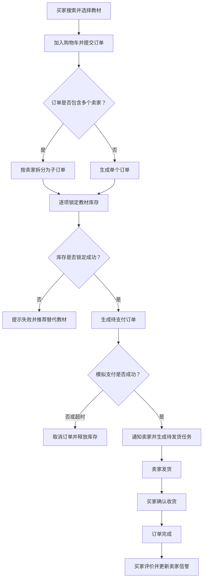

# 校园二手教材交易平台

## 项目简介

本项目建设一个校园二手教材交易平台，为高校学生提供教材发布、检索、购买、订单跟踪和评价等能力，帮助学生低成本获取教材，并提高闲置教材的利用率。

## 业务背景

每学期都会产生大量闲置教材，同时又有大量学生需要购买教材。目前交易信息往往分散在班级群、聊天群中，存在搜索困难、信息更新不及时、交易记录不完整、订单和商品状态难以追踪等问题。本项目聚焦校园教材场景，建立统一的交易平台，规范从发布、下单、支付、发货到确认收货和评价的完整流程。

## 项目目标与适用场景

本项目旨在建设一个校园二手教材交易平台，帮助学生发布、查找和购买闲置教材，形成从商品发布、下单、支付、发货到确认收货和评价的完整交易闭环。

适用场景包括：

- 学生在每学期结束后发布不再使用的教材。
- 学生在开学前搜索并购买价格合适的二手教材。
- 卖家管理商品、库存、订单和发货状态。
- 管理员审核商品、管理用户并处理异常交易。
- 后续用于验证服务拆分、消息通信、事务补偿、监控和部署等微服务能力。

## 目标用户与需求

| 用户角色 | 主要需求 |
|---|---|
| 学生买家 | 搜索教材，查看价格和书况，加入购物车，下单，模拟支付，跟踪订单，确认收货并评价 |
| 学生卖家 | 发布和编辑教材，管理库存，查看订单，处理发货，查看评价和交易记录 |
| 平台管理员 | 审核商品，管理用户，查询订单，处理违规内容和异常交易 |
| 游客 | 浏览教材列表和详情，注册或登录后参与交易 |

## 功能模块划分

| 功能模块 | 具体功能 |
|---|---|
| 用户与认证 | 注册、登录、退出、个人资料、角色权限、卖家认证、管理员权限 |
| 教材目录与检索 | 教材分类、关键词搜索、ISBN/书名/作者查询、书况展示、分页排序 |
| 商品与库存 | 发布教材、编辑价格和书况、上下架、库存锁定、库存释放、防止重复出售 |
| 购物车与订单 | 加入购物车、确认订单、按卖家拆单、订单状态流转、取消订单、超时关闭 |
| 支付 | 创建模拟支付单、支付回调、支付结果查询、幂等处理、超时取消 |
| 物流与履约 | 卖家发货、记录物流状态、买家确认收货、订单完成 |
| 评价与信誉 | 评分、文字评价、评价查询、卖家信誉更新 |
| 通知 | 支付成功、订单取消、卖家发货、订单完成等事件通知 |
| 后台管理 | 商品审核、用户管理、订单查询、违规下架、基础统计 |

## 核心业务流程

以“买家购买多个卖家的二手教材”为例：




## 当前项目范围

第一阶段聚焦核心交易闭环：

```text
发布教材 → 搜索浏览 → 下单 → 拆分订单 → 锁定库存
→ 模拟支付 → 卖家发货 → 确认收货 → 评价
```

当前阶段暂不实现：

- 真实第三方支付和真实物流接口。
- 实时聊天、议价和语音功能。
- 智能推荐、优惠券和秒杀活动。
- 复杂退款、售后仲裁和纠纷处理。
- 多校区、多仓库和跨平台同步。
- 完整的高并发和商业级容量规划。

支付和物流采用模拟方式，目的是突出微服务架构、服务协作和分布式问题，而不是实现完整商业电商平台。

## 后续演进方向

| 演进方向 | 后续内容 |
|---|---|
| 认证授权 | JWT/OAuth2、RBAC、角色权限、服务间认证、卖家实名认证 |
| 服务拆分 | 网关、用户、教材目录、商品库存、订单、支付、物流、评价、通知 |
| 数据持久化 | 每个服务独立数据库或独立 Schema，通过接口和事件访问数据 |
| 消息通信 | 订单创建、支付成功、支付超时、发货、确认收货、评价等事件 |
| 事务处理 | Saga、Outbox、消息补偿、幂等消费、库存释放和超时取消 |
| 监控运维 | 健康检查、日志聚合、指标监控、链路追踪和告警 |
| 部署发布 | Docker Compose、配置管理、CI/CD，后续可扩展到 Kubernetes |

## 课程信息

- 课程：微服务开发与实践
- 姓名：请填写
- 学号：2412190107
- 仓库用途：本仓库用于完成《微服务开发与实践》课程项目，设计并实现一个校园二手教材交易平台。系统面向买家、卖家和管理员，支持二手教材发布、检索、下单、多卖家订单拆分、库存锁定与释放、模拟支付、物流跟踪、评价和通知等核心业务流程。
